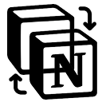

  

<h1 align="center">Notion Switcher</h1>

  <strong>Every switch opens your next possibility.</strong> 
  Switching workspaces isn't just navigation — it's stepping into your next idea.

  <a href="README.ko.md">한국어</a> · English

---

Notion Switcher is a Chrome extension that lets you jump between Notion workspaces in under 2 seconds. Press `Alt+N`, hit a number key, and you're there.

Each workspace holds a different project, a different role, a different dream. We believe faster switching means more time creating — and that's where real change begins.

---

## Features

### Instant Switch
- Press `1`~`9` to jump to any workspace
- `Enter` opens the first search result
- `Shift+click` opens in a new tab
- Real-time search by name, URL, or emoji

### Two Views
- **Popup** (`Alt+N`) — compact 320px panel for quick switching
- **Dashboard** (`Alt+Shift+N`) — full-page grid with falling cube animations

### Organization
- **Folders** — group workspaces by topic
- **Drag & Drop** — reorder freely, move between folders
- **Add / Edit / Delete** with name, URL, emoji, and color

### Personalization
- **Theme** — System / Light / Dark
- **Custom shortcuts** — remap keyboard shortcuts with conflict detection
- **i18n** — auto Korean/English based on browser language

---

## Keyboard Shortcuts

| Shortcut | Action | Scope |
|----------|--------|-------|
| `Alt+N` | Open popup | Global |
| `Alt+Shift+N` | Open dashboard | Global |
| `1`~`9` | Jump to workspace | Popup / Dashboard |
| `Enter` | Open first result | Search |
| `Escape` | Clear search / close | Popup / Dashboard |
| `/` | Focus search | Dashboard |
| `D` | Open dashboard | Popup (empty search) |

---

## Install

### Chrome Web Store
Coming soon.

### From source (Developer mode)
1. Go to `chrome://extensions`
2. Enable **Developer mode**
3. Click **Load unpacked**
4. Select the `notion-switcher` folder

---

## Tech Stack

| | |
|---|---|
| Platform | Chrome Extension (Manifest V3) |
| Language | Vanilla JavaScript |
| Storage | chrome.storage.sync |
| Styling | CSS Custom Properties |
| i18n | Chrome i18n API |
| Build | None (zero bundler) |

---

## Privacy

- **No data collection** — everything stays in your browser
- No analytics, no tracking, no account required
- Uses Chrome's built-in sync only
- [Privacy Policy](PRIVACY.md)

---

## Feedback

Bug reports & feature requests → [Feedback Form](https://tally.so/r/9qxE61)

---

## License

MIT
